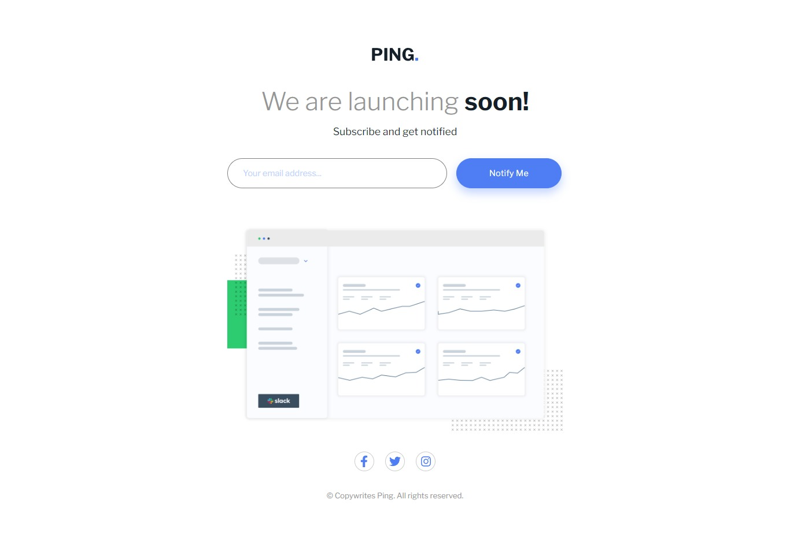

# Frontend Mentor - Ping coming soon page solution

This is a solution to the [Ping coming soon page challenge on Frontend Mentor](https://www.frontendmentor.io/challenges/ping-single-column-coming-soon-page-5cadd051fec04111f7b848da). Frontend Mentor challenges help you improve your coding skills by building realistic projects. 

## Table of contents

- [Overview](#overview)
  - [The challenge](#the-challenge)
  - [Screenshot](#screenshot)
  - [Links](#links)
- [My process](#my-process)
  - [Built with](#built-with)
  - [What I learned](#what-i-learned)
  - [Continued development](#continued-development)
  - [Useful resources](#useful-resources)
- [Author](#author)

## Overview

### The challenge

Users should be able to:

- View the optimal layout for the site depending on their device's screen size
- See hover states for all interactive elements on the page
- Submit their email address using an `input` field
- Receive an error message when the `form` is submitted if:
	- The `input` field is empty. The message for this error should say *"Whoops! It looks like you forgot to add your email"*
	- The email address is not formatted correctly (i.e. a correct email address should have this structure: `name@host.tld`). The message for this error should say *"Please provide a valid email address"*

### Screenshot



### Links

- Solution URL: [Add solution URL here](https://your-solution-url.com)
- Live Site URL: [Add live site URL here](https://your-live-site-url.com)

## My process

### Built with

- Semantic HTML5 markup
- CSS custom properties
- Flexbox
- Mobile-first workflow
- [React](https://reactjs.org/) - JS library
- [Vite.js](https://vitejs.dev/) - React framework

### What I learned

- I got a good grasp of hidding and displaying contents for different devices
- I also learnt conditional styling

```css
.desktopHidden {
  display: none;
}
```

### Continued development

In the future, I would like to use webstorage to tell the persons preferred mode and provide a light/dark mode toggler.
The default mode should be taken from the user's current time

### Useful resources

- [Dev.to](https://dev.to/salehmubashar/conditional-styling-in-reactjs-3h52) - This is an amazing article which helped me finally understand conditional styling in reactjs. I'd recommend it to anyone still learning this concept.

## Author

- Frontend Mentor - [@Imhandegbelo](https://www.frontendmentor.io/profile/Imhandegbelo)
- Twitter - [@ImhandegbeloG](https://www.twitter.com/ImhandegbeloG)
